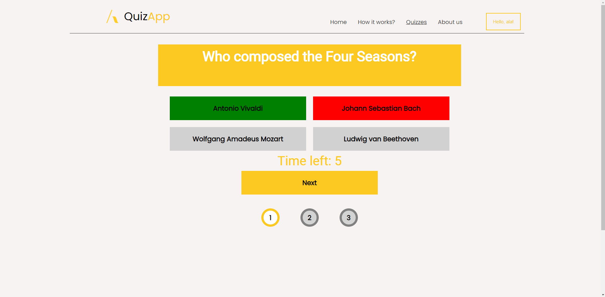

# QuizzApp




## 🌟 Project aim

This project was one of the first that initiated our learning of advanced web technologies. It incorporates many aspects that, with the benefit of hindsight, we now realize should have been done differently. Nevertheless, we have chosen to leave this project in its original form. We decided not to perform a code refactor so as to showcase our progress over time, which you can observe in the rest of our projects.

The primary aim of this project was to create a user-friendly web application that enables users to take quizzes and contribute their own quiz content.

## 📖 Table of contents

- [Team](#-team)
- [To do](#-to-do)
- [Features](#-features)
- [Project status](#-project-status)
- [Setup](#-setup)
- [Technologies](#%EF%B8%8F-technologies--tools)
- [License](#-license)

## 👥 Team

Mentors: Adrian Widłak, Katarzyna Mrawczyńska

- [Michał Zuzak](https://github.com/michalz18)
- [Wiktoria Kulczyńska](https://github.com/wiktoria75)
- [Marcin Lewiński](https://github.com/marcinlewinski)
- [Artur Pokora](https://github.com/ArtIPok)

## 📝 To do

- Code refactor
- Application deployment
- End to end tests
- Implement CI/CD
- Data cache

## ✨ Features

- Users can create their own quizzes.
- Users can participate in various quizzes.
- The system allows users to track their performance in each completed quiz.
- Authentication is facilitated through Google OAuth 2.0.
- The application is responsive and accessible.
- It utilizes a non-relational database for efficient data management.

## 🟢 Project status

This project is considered complete and stable, and all planned features have been implemented.

Thank you for your interest in this project. We hope that you find it useful. Please feel free to fork this repository and use it as a starting point for your own project, or to learn from the code.

If you want to see a live version, at the top of the readme.md, a GIF with our application should load. Alternatively, if you prefer, you can go to the tab below (Setup) and run the application locally on your machine.

## 🌐 Setup

To run the application, follow these steps:
1. **Clone the Repository**: Clone the project repository to your computer by running the command:

    ```bash
    git clone https://github.com/marcinlewinski/QuizApp.git
    ```

2. **Add your .env file**: Create a file named `.env` at the /server file and add the following content:

    ```env
    NODE_ENV_GOOGLE_CLIENT_ID=YOUR_CLIENT_ID
    NODE_ENV_GOOGLE_CLIENT_SECRET=YOUR_CLIENT_SECRET
    ```

    Replace `YOUR_CLIENT_ID` and `YOUR_CLIENT_SECRET` with your actual Google OAuth credentials.

3. **Run Docker Compose**: Start the Docker Desktop application, and then enter the following command in the terminal:

    ```bash
    docker-compose up 
    ```

Alternatively, you can run the application using the following scripts:
1. For macOS or Linux, execute `startQuizApp_macOS.sh` (You need to make it executable by running `chmod +x startQuizApp_macOS.sh` in your terminal).
2. For Windows, run `startQuizApp_Windows.ps1` (double click it).
 
Once the application starts, open your web browser and enter the following URL in the address bar: "http://localhost:3000"
Now, you are ready to run the application with the configured environment. Enjoy using the Quiz App!

## 🛠️ Technologies & Tools

Project is created with:

<a  href="https://developer.mozilla.org/en-US/docs/Web/JavaScript"  target="_blank"  rel="noreferrer">  </a>   

<a  href="https://reactjs.org/"  target="_blank"  rel="noreferrer">  </a> <a href="https://expressjs.com" target="_blank" rel="noreferrer">  </a> 

<a  href="https://www.w3.org/html/"  target="_blank"  rel="noreferrer">  </a><a  href="https://www.w3schools.com/css/"  target="_blank"  rel="noreferrer">  </a> 
<a href="https://www.mongodb.com/" target="_blank" rel="noreferrer">

</a>

<a  href="https://code.visualstudio.com/"  target="_blank"  rel="noreferrer">

</a>

<a  href="https://git-scm.com/"  target="_blank"  rel="noreferrer">  </a><a  href="https://postman.com/"  target="_blank"  rel="noreferrer">  </a><a  href="https://www.figma.com/"  target="_blank"  rel="noreferrer">  </a>

## 📜 License

QuizzApp is [MIT](https://choosealicense.com/licenses/mit/) licensed.
